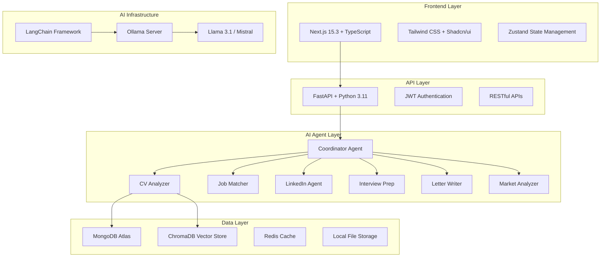
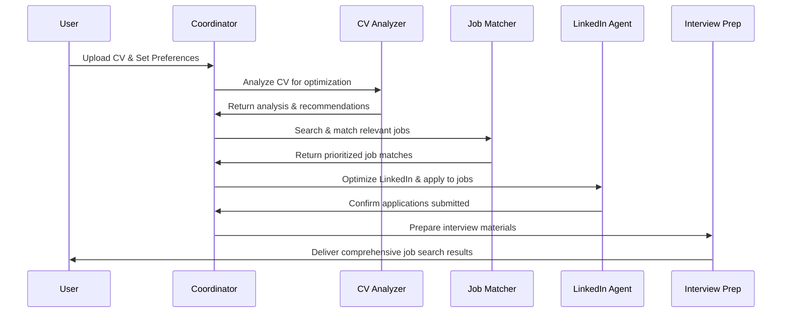

# 🚀 Career AI System

[](https://opensource.org/licenses/MIT)
[](https://nextjs.org/)
[](https://fastapi.tiangolo.com/)
[](https://www.mongodb.com/)
[](https://www.typescriptlang.org/)
[](https://www.python.org/)
[](https://ollama.ai/)

> **An AI-Powered Multi-Agent Career Management System** that automates your entire job search journey from CV optimization to interview preparation and LinkedIn automation.


## 🎯 Overview

Career AI System is a cutting-edge, fully automated job search platform that leverages multiple AI agents to handle every aspect of your career development. From intelligent CV analysis to LinkedIn automation, interview preparation, and market insights - all powered by local LLMs through Ollama.

### 🌟 Key Highlights

- **🤖 Multi-Agent Architecture**: 15+ specialized AI agents working in harmony
- **📄 Intelligent CV Optimization**: ATS-compatible CV generation tailored for each job
- **🔗 LinkedIn Automation**: Profile optimization and strategic networking
- **💼 Smart Job Matching**: AI-powered compatibility scoring and application automation  
- **🎤 Interview Preparation**: Mock interviews, company research, and Q&A generation
- **📊 Market Intelligence**: Real-time salary analysis and skill gap identification
- **🚀 Zero-Dependency**: No AWS required - fully local deployment with MongoDB

## 🏗️ System Architecture



## ✨ Features

### 🎯 Core Functionality

- **📋 Document Management**
  - Multi-format CV upload (PDF, DOCX, TXT)
  - Version control and document history
  - Certificate and diploma storage
  - AI-powered text extraction and analysis

- **🔍 Intelligent Job Search**
  - Multi-platform job scraping (LinkedIn, Indeed, Glassdoor)
  - Real-time job alerts and notifications
  - Advanced filtering and search capabilities
  - Market trend analysis and insights

- **🤝 LinkedIn Integration**
  - Profile optimization recommendations
  - Automated connection requests
  - Strategic post scheduling
  - Network analysis and expansion

### 🤖 AI Agents

| Agent | Capability | Description |
|-------|------------|-------------|
| **CV Analyzer** | Document Analysis | ATS compatibility, keyword optimization, structure analysis |
| **CV Optimizer** | Content Enhancement | Tailored CV rewriting for specific job requirements |
| **Job Matcher** | Compatibility Scoring | AI-powered job-candidate matching with detailed scoring |
| **LinkedIn Agent** | Profile Automation | Complete LinkedIn presence optimization and automation |
| **Letter Writer** | Content Generation | Personalized motivation letters and cover letters |
| **Interview Prep** | Interview Training | Mock interviews, Q&A generation, company research |
| **Market Analyzer** | Intelligence Gathering | Salary trends, skill demand, industry insights |
| **Application Automator** | Workflow Automation | End-to-end application submission automation |
| **Follow-up Agent** | Communication | Automated follow-up sequences and response tracking |
| **Network Agent** | Relationship Building | Strategic networking and connection management |
| **Skill Gap Analyzer** | Career Development | Skill assessment and learning path recommendations |
| **Coordinator** | Orchestration | Master agent coordinating all workflow processes |

### 📊 Analytics & Insights

- **Market Intelligence Dashboard**
  - Real-time salary benchmarking
  - Skill demand forecasting
  - Industry growth predictions
  - Geographic market analysis

- **Personal Performance Tracking**
  - Application success rates
  - Interview conversion metrics
  - Profile optimization scores
  - LinkedIn engagement analytics

## 🛠️ Technology Stack

### Frontend
```typescript
- Next.js 15.3 with App Router
- TypeScript for type safety
- Tailwind CSS + Shadcn/ui components
- Zustand for state management
- React Hook Form for form handling
- Recharts for data visualization
- React PDF for document viewing
```

### Backend
```python
- FastAPI with async/await support
- MongoDB with Motor async driver
- Pydantic for data validation
- LangChain for AI orchestration
- Ollama for local LLM inference
- Celery for background tasks
- Redis for caching and queues
```

### AI & ML
```bash
- Ollama (Local LLM Server)
- Llama 3.1, Mistral, CodeLlama models
- ChromaDB for vector storage
- LangChain + LangGraph for agents
- sentence-transformers for embeddings
- Beautiful Soup + Selenium for web scraping
```

### Infrastructure
```yaml
- Docker + Docker Compose
- MongoDB (local or Atlas)
- Redis for caching
- Nginx for reverse proxy
- GitHub Actions for CI/CD
```

## 🚀 Quick Start

### Prerequisites

- **Node.js** 18+ and npm/yarn
- **Python** 3.11+
- **Docker** and Docker Compose
- **Git** for version control

### 1. Clone the Repository

```bash
git clone https://github.com/ChadSaglam/career-ai-system.git
cd career-ai-system
```

### 2. Environment Setup

```bash
# Copy environment files
cp .env.example .env
cp frontend/.env.local.example frontend/.env.local
cp backend/.env.example backend/.env

# Edit configuration files with your settings
```

### 3. Start Infrastructure Services

```bash
# Start MongoDB, Redis, Ollama, and ChromaDB
docker-compose up -d

# Pull required Ollama models
docker exec ollama ollama pull llama3.1
docker exec ollama ollama pull mistral
docker exec ollama ollama pull codellama
```

### 4. Backend Setup

```bash
cd backend

# Create virtual environment
python -m venv venv
source venv/bin/activate  # Windows: venv\Scripts\activate

# Install dependencies
pip install -r requirements.txt

# Run database migrations
python scripts/setup_database.py

# Start the API server
uvicorn app.main:app --reload --host 0.0.0.0 --port 8080
```

### 5. Frontend Setup

```bash
cd frontend

# Install dependencies
npm install

# Start development server
npm run dev
```

### 6. Access the Application

- **Frontend**: http://localhost:3000
- **API Documentation**: http://localhost:8080/docs
- **MongoDB Express**: http://localhost:8081
- **Ollama**: http://localhost:11434

## 📖 Usage Guide

### 1. Initial Setup

1. **Register Account**: Create your user account
2. **Upload Documents**: Add your CV, certificates, and diplomas
3. **Complete Profile**: Fill in personal and professional information
4. **Set Preferences**: Configure job search criteria and automation settings

### 2. AI-Powered Workflow



### 3. Core Workflows

#### **CV Optimization**
```bash
# Upload your CV
POST /api/documents/upload

# Trigger AI analysis
POST /api/analysis/cv-analyze

# Get optimization suggestions
GET /api/analysis/cv-optimization

# Generate tailored CV for specific job
POST /api/cv/optimize-for-job
```

#### **Job Search Automation**
```bash
# Configure search parameters
POST /api/jobs/search-config

# Start automated job search
POST /api/agents/start-job-search

# Monitor progress
GET /api/agents/workflow-status

# Review results
GET /api/jobs/applications
```

#### **LinkedIn Automation**
```bash
# Connect LinkedIn account
POST /api/linkedin/connect

# Optimize profile
POST /api/linkedin/optimize-profile

# Start automation workflow
POST /api/linkedin/start-automation

# Track activities
GET /api/linkedin/activities
```

### 4. Interview Preparation

```typescript
// Schedule interview preparation
const prepareInterview = async (jobApplicationId: string) => {
  const response = await fetch('/api/interviews/prepare', {
    method: 'POST',
    headers: { 'Content-Type': 'application/json' },
    body: JSON.stringify({ jobApplicationId })
  });
  
  return response.json();
};

// Get company research and Q&A
const getInterviewMaterials = async (interviewId: string) => {
  const response = await fetch(`/api/interviews/${interviewId}/materials`);
  return response.json();
};
```

## 🧩 Project Structure

```
career-ai-system/
├── frontend/                          # Next.js 15.3 Frontend
│   ├── app/                          # App Router Pages
│   │   ├── (auth)/                   # Authentication pages
│   │   │   ├── login/
│   │   │   └── register/
│   │   ├── dashboard/                # Main dashboard
│   │   │   ├── page.tsx
│   │   │   ├── analytics/
│   │   │   └── settings/
│   │   ├── documents/                # Document management
│   │   │   ├── upload/
│   │   │   ├── cv-editor/
│   │   │   └── analysis/
│   │   ├── jobs/                     # Job search & applications
│   │   │   ├── search/
│   │   │   ├── applications/
│   │   │   └── tracker/
│   │   ├── linkedin/                 # LinkedIn features
│   │   │   ├── profile/
│   │   │   ├── automation/
│   │   │   └── analytics/
│   │   ├── interviews/               # Interview preparation
│   │   │   ├── preparation/
│   │   │   ├── practice/
│   │   │   └── feedback/
│   │   ├── agents/                   # AI agents control
│   │   │   ├── workflows/
│   │   │   ├── monitoring/
│   │   │   └── configuration/
│   │   └── analytics/                # Market insights
│   │       ├── market-trends/
│   │       ├── salary-analysis/
│   │       └── skill-gaps/
│   ├── components/                   # Reusable Components
│   │   ├── ui/                      # Basic UI components
│   │   │   ├── button.tsx
│   │   │   ├── card.tsx
│   │   │   ├── chart.tsx
│   │   │   └── ...
│   │   ├── layout/                  # Layout components
│   │   │   ├── navigation.tsx
│   │   │   ├── sidebar.tsx
│   │   │   └── header.tsx
│   │   ├── forms/                   # Form components
│   │   │   ├── cv-form.tsx
│   │   │   ├── job-search-form.tsx
│   │   │   └── profile-form.tsx
│   │   ├── charts/                  # Data visualization
│   │   │   ├── progress-chart.tsx
│   │   │   ├── market-chart.tsx
│   │   │   └── analytics-chart.tsx
│   │   ├── agents/                  # Agent-related components
│   │   │   ├── agent-card.tsx
│   │   │   ├── workflow-builder.tsx
│   │   │   └── status-monitor.tsx
│   │   └── features/                # Feature-specific components
│   │       ├── cv-optimizer/
│   │       ├── job-matcher/
│   │       ├── interview-prep/
│   │       └── linkedin-tools/
│   ├── lib/                         # Utilities
│   │   ├── api.ts                   # API client
│   │   ├── auth.ts                  # Authentication
│   │   ├── utils.ts                 # General utilities
│   │   └── validations.ts           # Form validations
│   ├── hooks/                       # Custom React hooks
│   │   ├── useAuth.ts
│   │   ├── useAgents.ts
│   │   ├── useJobs.ts
│   │   └── useAnalytics.ts
│   ├── types/                       # TypeScript definitions
│   │   ├── api.ts
│   │   ├── agents.ts
│   │   ├── jobs.ts
│   │   └── user.ts
│   └── styles/                      # Styling
│       ├── globals.css
│       └── components.css
├── backend/                         # Python FastAPI Backend
│   ├── app/
│   │   ├── agents/                  # Multi-Agent System
│   │   │   ├── __init__.py
│   │   │   ├── base_agent.py        # Base agent class
│   │   │   ├── coordinator.py       # Main orchestrator
│   │   │   ├── cv/                  # CV-related agents
│   │   │   │   ├── analyzer.py
│   │   │   │   ├── optimizer.py
│   │   │   │   └── document_manager.py
│   │   │   ├── jobs/                # Job-related agents
│   │   │   │   ├── scraper.py
│   │   │   │   ├── matcher.py
│   │   │   │   └── automator.py
│   │   │   ├── linkedin/            # LinkedIn agents
│   │   │   │   ├── profile_optimizer.py
│   │   │   │   ├── automation.py
│   │   │   │   └── network_manager.py
│   │   │   ├── interview/           # Interview agents
│   │   │   │   ├── preparation.py
│   │   │   │   ├── practice.py
│   │   │   │   └── feedback.py
│   │   │   ├── analysis/            # Analysis agents
│   │   │   │   ├── market_analyzer.py
│   │   │   │   ├── skill_gap.py
│   │   │   │   └── salary_analyzer.py
│   │   │   └── communication/       # Communication agents
│   │   │       ├── letter_writer.py
│   │   │       ├── follow_up.py
│   │   │       └── networking.py
│   │   ├── api/                     # FastAPI Routes
│   │   │   ├── v1/
│   │   │   │   ├── auth.py
│   │   │   │   ├── users.py
│   │   │   │   ├── documents.py
│   │   │   │   ├── jobs.py
│   │   │   │   ├── linkedin.py
│   │   │   │   ├── interviews.py
│   │   │   │   ├── agents.py
│   │   │   │   └── analytics.py
│   │   │   └── dependencies.py
│   │   ├── core/                    # Core configurations
│   │   │   ├── config.py
│   │   │   ├── database.py
│   │   │   ├── security.py
│   │   │   └── logging.py
│   │   ├── models/                  # Pydantic models
│   │   │   ├── user.py
│   │   │   ├── document.py
│   │   │   ├── job.py
│   │   │   ├── linkedin.py
│   │   │   ├── interview.py
│   │   │   └── analytics.py
│   │   ├── services/                # Business logic
│   │   │   ├── auth_service.py
│   │   │   ├── document_service.py
│   │   │   ├── job_service.py
│   │   │   ├── linkedin_service.py
│   │   │   ├── interview_service.py
│   │   │   ├── agent_service.py
│   │   │   └── analytics_service.py
│   │   ├── utils/                   # Helper functions
│   │   │   ├── document_parser.py
│   │   │   ├── web_scraper.py
│   │   │   ├── email_sender.py
│   │   │   └── ai_utils.py
│   │   └── main.py                  # FastAPI app
│   ├── tests/                       # Test suite
│   │   ├── test_agents/
│   │   ├── test_api/
│   │   └── test_services/
│   ├── requirements.txt
│   ├── Dockerfile
│   └── .env.example
├── storage/                         # Local File Storage
│   ├── documents/                   # User documents
│   │   ├── cvs/
│   │   ├── certificates/
│   │   ├── diplomas/
│   │   └── references/
│   ├── generated/                   # AI-generated content
│   │   ├── motivation_letters/
│   │   ├── optimized_cvs/
│   │   ├── interview_prep/
│   │   └── linkedin_content/
│   ├── templates/                   # Document templates
│   │   ├── cv_templates/
│   │   ├── letter_templates/
│   │   └── email_templates/
│   └── temp/                       # Temporary files
├── ollama/                         # Ollama Configuration
│   ├── models/
│   │   ├── cv_model.py
│   │   ├── linkedin_model.py
│   │   └── interview_model.py
│   ├── prompts/
│   │   ├── cv_optimization.txt
│   │   ├── job_matching.txt
│   │   ├── interview_prep.txt
│   │   └── linkedin_content.txt
│   └── docker-compose.yml
├── infrastructure/                 # Infrastructure as Code
│   ├── docker/
│   │   ├── docker-compose.yml
│   │   ├── docker-compose.prod.yml
│   │   └── nginx/
│   ├── monitoring/
│   │   ├── prometheus/
│   │   └── grafana/
│   └── backup/
│       └── mongodb_backup.sh
├── docs/                          # Documentation
│   ├── API.md
│   ├── AGENTS.md
│   ├── DEPLOYMENT.md
│   └── USER_GUIDE.md
├── scripts/                       # Automation Scripts
│   ├── setup.sh
│   ├── deploy.sh
│   ├── seed_data.py
│   ├── backup.py
│   └── test.sh
├── .github/                       # GitHub Actions
│   └── workflows/
│       ├── ci.yml
│       ├── deploy.yml
│       └── test.yml
├── docker-compose.yml             # Development environment
├── docker-compose.prod.yml        # Production environment
├── README.md
├── LICENSE
└── .gitignore
```

## 🤝 Contributing

We welcome contributions! Please see our [Contributing Guidelines](CONTRIBUTING.md) for details.

### Development Workflow

1. **Fork the repository**
2. **Create a feature branch**
   ```bash
   git checkout -b feature/amazing-feature
   ```
3. **Make your changes**
4. **Add tests** for your changes
5. **Run the test suite**
   ```bash
   # Backend tests
   cd backend && pytest

   # Frontend tests  
   cd frontend && npm test
   ```
6. **Submit a pull request**

### Code Style

- **Frontend**: ESLint + Prettier configuration
- **Backend**: Black + isort + flake8
- **Commits**: Conventional Commits format

## 📊 Roadmap

### Phase 1: Foundation 
#### Step 1.1: Repository Creation & Structure
- [ ] Create main repository: career-ai-system
- [ ] Setup project structure with all directories
- [ ] Initialize Git with proper .gitignore
- [ ] Setup GitHub Actions for CI/CD

#### Step 1.2: Development Environment
- [ ] Docker setup for all services (MongoDB, Redis, Ollama, ChromaDB)
- [ ] Environment configuration files
- [ ] Local development scripts
- [ ] Database schema design and initial migrations

#### Step 1.3: Backend Foundation
- [ ] FastAPI project initialization
- [ ] MongoDB connection with Motor
- [ ] Basic authentication system
- [ ] Core API structure with routers
- [ ] Pydantic models for all entities

#### Step 1.4: Frontend Foundation
- [ ] Next.js 15.3 project setup with TypeScript
- [ ] Tailwind CSS configuration
- [ ] Shadcn/ui component library setup
- [ ] Basic layout and routing structure
- [ ] Authentication pages (login/register)

### Phase 2: Document Management System
#### Step 2.1: File Upload System
- [ ] React dropzone implementation
- [ ] File validation (PDF, DOCX, images)
- [ ] Progress indicators and error handling
- [ ] Multi-file upload support
 
#### Step 2.2: Document Processing Backend
- [ ] PDF text extraction (PyPDF2, pdfplumber)
- [ ] DOCX processing (python-docx)
- [ ] File storage organization
- [ ] Metadata extraction and indexing

#### Step 2.3: Document Viewer
- [ ] PDF viewer component (react-pdf)
- [ ] Document preview functionality
- [ ] Text highlighting and annotation
- [ ] Version management system

#### Step 2.4: Basic CV Analysis Agent
- [ ] Text parsing and structure analysis
- [ ] Skills extraction using NLP
- [ ] Experience timeline parsing
- [ ] Education information extraction

#### Step 2.5: CV Scoring System
- [ ] ATS compatibility scoring
- [ ] Keyword density analysis
- [ ] Format and structure scoring
- [ ] Improvement suggestions generation

### Phase 3: Multi-Agent System Development 
#### Step 3.1: Base Agent Architecture
- [ ] Abstract base agent class
- [ ] LangChain integration with Ollama
- [ ] Agent communication protocols
- [ ] Memory management system

#### Step 3.2: CV Analyzer Agent
- [ ] Comprehensive CV analysis
- [ ] Skills categorization (technical/soft/languages)
- [ ] Experience level assessment
- [ ] Gap identification

#### Step 3.3: CV Optimizer Agent
- [ ] CV rewriting capabilities
- [ ] Keyword optimization
- [ ] ATS-friendly formatting
- [ ] Tailored content generation

#### Step 3.4: Job Scraper Agent
- [ ] LinkedIn job scraping
- [ ] Indeed integration
- [ ] Company website parsing
- [ ] Job data normalization

#### Step 3.5: Job Matcher Agent
- [ ] Compatibility scoring algorithm
- [ ] Skills matching analysis
- [ ] Experience relevance assessment
- [ ] Location and salary filtering

#### Step 3.6: Letter Writer Agent
- [ ] Motivation letter templates
- [ ] Personalized content generation
- [ ] Company-specific customization
- [ ] Multiple language support

#### Step 3.7: Agent Orchestration
- [ ] Workflow coordination system
- [ ] Task scheduling and prioritization
- [ ] Result aggregation
- [ ] Error handling and recovery

### Phase 4: LinkedIn Automation & Optimization
#### Step 4.1: LinkedIn Profile Analyzer
- [ ] Profile scraping (with user consent)
- [ ] Headline optimization suggestions
- [ ] Summary enhancement
- [ ] Skills section optimization

#### Step 4.2: Profile Optimization Agent
- [ ] Industry-specific recommendations
- [ ] Keyword integration for searchability
- [ ] Professional summary rewriting
- [ ] Achievement highlighting

#### Step 4.3: LinkedIn Content Generator
- [ ] Post content creation
- [ ] Industry-relevant articles
- [ ] Engagement-focused content
- [ ] Hashtag optimization

#### Step 4.4: Connection Automation
- [ ] Strategic connection targeting
- [ ] Personalized connection requests
- [ ] Follow-up message sequences
- [ ] Network expansion strategies

#### Step 4.5: Job Application Automation
- [ ] Automated job applications
- [ ] Application tracking
- [ ] Response monitoring
- [ ] Follow-up scheduling

#### Step 4.6: Engagement Automation
- [ ] Post liking and commenting
- [ ] Industry group participation
- [ ] Content sharing strategies
- [ ] Thought leadership building

### Phase 5: Interview Preparation & Management
#### Step 5.1: Company Research Agent
- [ ] Company culture analysis
- [ ] Recent news and developments
- [ ] Key personnel research
- [ ] Industry positioning analysis

#### Step 5.2: Question Generation Agent
- [ ] Role-specific question generation
- [ ] Behavioral interview questions
- [ ] Technical assessment preparation
- [ ] STAR method response templates

#### Step 5.3: Answer Optimization Agent
- [ ] Response structure optimization
- [ ] Personal story integration
- [ ] Confidence scoring
- [ ] Improvement suggestions

#### Step 5.4: Mock Interview System
- [ ] AI-powered mock interviews
- [ ] Voice recognition integration
- [ ] Real-time feedback
- [ ] Performance analytics

#### Step 5.5: Interview Tracking
- [ ] Interview scheduling management
- [ ] Preparation checklist
- [ ] Feedback collection
- [ ] Outcome tracking

#### Step 5.6: Post-Interview Follow-up
- [ ] Thank you note generation
- [ ] Follow-up timeline management
- [ ] Next steps tracking
- [ ] Negotiation preparation

### Phase 6: Market Intelligence & Analytics
#### Step 6.1: Market Analyzer Agent
- [ ] Job market trend analysis
- [ ] Salary benchmarking
- [ ] Skill demand forecasting
- [ ] Industry growth predictions

#### Step 6.2: Skill Gap Analyzer Agent
- [ ] Current skills assessment
- [ ] Market requirement analysis
- [ ] Learning path recommendations
- [ ] Certification suggestions

#### Step 6.3: Analytics Dashboard
- [ ] Market insights visualization
- [ ] Personal progress tracking
- [ ] Performance metrics
- [ ] Predictive analytics

#### Step 6.4: Networking Intelligence
- [ ] Strategic networking recommendations
- [ ] Relationship mapping
- [ ] Influence scoring
- [ ] Connection value analysis

#### Step 6.5: Career Path Advisor
- [ ] Career progression analysis
- [ ] Role transition recommendations
- [ ] Skill development roadmaps
- [ ] Timeline planning

#### Step 6.6: Salary Negotiation Assistant
- [ ] Market rate analysis
- [ ] Negotiation strategy development
- [ ] Counter-offer preparation
- [ ] Benefits optimization

## 📄 License

This project is licensed under the MIT License - see the [LICENSE](LICENSE) file for details.

## 🙏 Acknowledgments

- [Ollama](https://ollama.ai/) for local LLM infrastructure
- [LangChain](https://langchain.com/) for AI agent framework
- [Shadcn/ui](https://ui.shadcn.com/) for beautiful UI components
- [FastAPI](https://fastapi.tiangolo.com/) for the robust backend framework

## 📞 Contact & Support

- **Developer**: Chad Saglam ([ChadSaglam](https://github.com/ChadSaglam))
- **Organization**: [ChadevDevelopment](https://github.com/ChadevDevelopment)
- **Email**: ([ChadSaglam](saglam.chad@chadev.ch))

### 🐛 Bug Reports & Feature Requests

Please use [GitHub Issues](https://github.com/ChadSaglam/career-ai-system/issues) to report bugs or request features.

### 💬 Community

Join our discussions in [GitHub Discussions](https://github.com/ChadSaglam/career-ai-system/discussions) for questions, ideas, and community support.

---

<div align="center">
<p><strong>Built with ❤️ by ChadSaglam</strong></p>
<p>⭐ Star this repository if you find it helpful!</p>
</div>