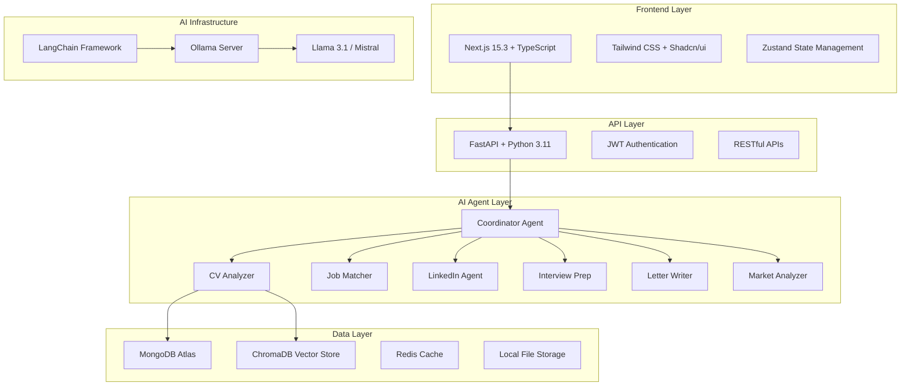
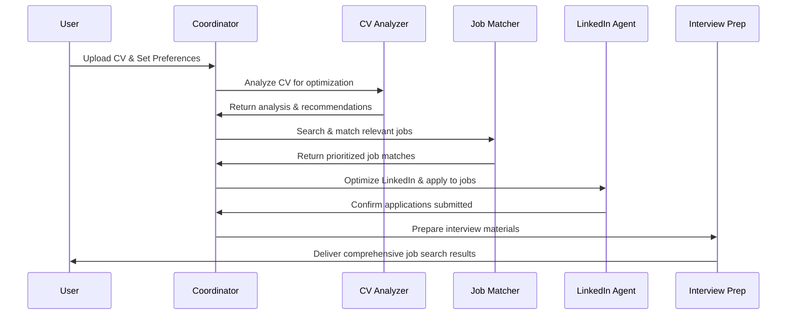

# 🚀 Career AI System

[](https://opensource.org/licenses/MIT)
[](https://nextjs.org/)
[](https://fastapi.tiangolo.com/)
[](https://www.mongodb.com/)
[](https://www.typescriptlang.org/)
[](https://www.python.org/)
[](https://ollama.ai/)

> **An AI-Powered Multi-Agent Career Management System** that automates your entire job search journey from CV optimization to interview preparation and LinkedIn automation.


## 🎯 Overview

Career AI System is a cutting-edge, fully automated job search platform that leverages multiple AI agents to handle every aspect of your career development. From intelligent CV analysis to LinkedIn automation, interview preparation, and market insights - all powered by local LLMs through Ollama.

### 🌟 Key Highlights

- **🤖 Multi-Agent Architecture**: 15+ specialized AI agents working in harmony
- **📄 Intelligent CV Optimization**: ATS-compatible CV generation tailored for each job
- **🔗 LinkedIn Automation**: Profile optimization and strategic networking
- **💼 Smart Job Matching**: AI-powered compatibility scoring and application automation  
- **🎤 Interview Preparation**: Mock interviews, company research, and Q&A generation
- **📊 Market Intelligence**: Real-time salary analysis and skill gap identification
- **🚀 Zero-Dependency**: No AWS required - fully local deployment with MongoDB

## 🏗️ System Architecture



## ✨ Features

### 🎯 Core Functionality

- **📋 Document Management**
  - Multi-format CV upload (PDF, DOCX, TXT)
  - Version control and document history
  - Certificate and diploma storage
  - AI-powered text extraction and analysis

- **🔍 Intelligent Job Search**
  - Multi-platform job scraping (LinkedIn, Indeed, Glassdoor)
  - Real-time job alerts and notifications
  - Advanced filtering and search capabilities
  - Market trend analysis and insights

- **🤝 LinkedIn Integration**
  - Profile optimization recommendations
  - Automated connection requests
  - Strategic post scheduling
  - Network analysis and expansion

### 🤖 AI Agents

| Agent | Capability | Description |
|-------|------------|-------------|
| **CV Analyzer** | Document Analysis | ATS compatibility, keyword optimization, structure analysis |
| **CV Optimizer** | Content Enhancement | Tailored CV rewriting for specific job requirements |
| **Job Matcher** | Compatibility Scoring | AI-powered job-candidate matching with detailed scoring |
| **LinkedIn Agent** | Profile Automation | Complete LinkedIn presence optimization and automation |
| **Letter Writer** | Content Generation | Personalized motivation letters and cover letters |
| **Interview Prep** | Interview Training | Mock interviews, Q&A generation, company research |
| **Market Analyzer** | Intelligence Gathering | Salary trends, skill demand, industry insights |
| **Application Automator** | Workflow Automation | End-to-end application submission automation |
| **Follow-up Agent** | Communication | Automated follow-up sequences and response tracking |
| **Network Agent** | Relationship Building | Strategic networking and connection management |
| **Skill Gap Analyzer** | Career Development | Skill assessment and learning path recommendations |
| **Coordinator** | Orchestration | Master agent coordinating all workflow processes |

### 📊 Analytics & Insights

- **Market Intelligence Dashboard**
  - Real-time salary benchmarking
  - Skill demand forecasting
  - Industry growth predictions
  - Geographic market analysis

- **Personal Performance Tracking**
  - Application success rates
  - Interview conversion metrics
  - Profile optimization scores
  - LinkedIn engagement analytics

## 🛠️ Technology Stack

### Frontend
```typescript
- Next.js 15.3 with App Router
- TypeScript for type safety
- Tailwind CSS + Shadcn/ui components
- Zustand for state management
- React Hook Form for form handling
- Recharts for data visualization
- React PDF for document viewing
```

### Backend
```python
- FastAPI with async/await support
- MongoDB with Motor async driver
- Pydantic for data validation
- LangChain for AI orchestration
- Ollama for local LLM inference
- Celery for background tasks
- Redis for caching and queues
```

### AI & ML
```bash
- Ollama (Local LLM Server)
- Llama 3.1, Mistral, CodeLlama models
- ChromaDB for vector storage
- LangChain + LangGraph for agents
- sentence-transformers for embeddings
- Beautiful Soup + Selenium for web scraping
```

### Infrastructure
```yaml
- Docker + Docker Compose
- MongoDB (local or Atlas)
- Redis for caching
- Nginx for reverse proxy
- GitHub Actions for CI/CD
```

## 🚀 Quick Start

### Prerequisites

- **Node.js** 18+ and npm/yarn
- **Python** 3.11+
- **Docker** and Docker Compose
- **Git** for version control

### 1. Clone the Repository

```bash
git clone https://github.com/ChadSaglam/career-ai-system.git
cd career-ai-system
```

### 2. Environment Setup

```bash
# Copy environment files
cp .env.example .env
cp frontend/.env.local.example frontend/.env.local
cp backend/.env.example backend/.env

# Edit configuration files with your settings
```

### 3. Start Infrastructure Services

```bash
# Start MongoDB, Redis, Ollama, and ChromaDB
docker-compose up -d

# Pull required Ollama models
docker exec ollama ollama pull llama3.1
docker exec ollama ollama pull mistral
docker exec ollama ollama pull codellama
```

### 4. Backend Setup

```bash
cd backend

# Create virtual environment
python -m venv venv
source venv/bin/activate  # Windows: venv\Scripts\activate

# Install dependencies
pip install -r requirements.txt

# Run database migrations
python scripts/setup_database.py

# Start the API server
uvicorn app.main:app --reload --host 0.0.0.0 --port 8080
```

### 5. Frontend Setup

```bash
cd frontend

# Install dependencies
npm install

# Start development server
npm run dev
```

### 6. Access the Application

- **Frontend**: http://localhost:3000
- **API Documentation**: http://localhost:8080/docs
- **MongoDB Express**: http://localhost:8081
- **Ollama**: http://localhost:11434

## 📖 Usage Guide

### 1. Initial Setup

1. **Register Account**: Create your user account
2. **Upload Documents**: Add your CV, certificates, and diplomas
3. **Complete Profile**: Fill in personal and professional information
4. **Set Preferences**: Configure job search criteria and automation settings

### 2. AI-Powered Workflow



### 3. Core Workflows

#### **CV Optimization**
```bash
# Upload your CV
POST /api/documents/upload

# Trigger AI analysis
POST /api/analysis/cv-analyze

# Get optimization suggestions
GET /api/analysis/cv-optimization

# Generate tailored CV for specific job
POST /api/cv/optimize-for-job
```

#### **Job Search Automation**
```bash
# Configure search parameters
POST /api/jobs/search-config

# Start automated job search
POST /api/agents/start-job-search

# Monitor progress
GET /api/agents/workflow-status

# Review results
GET /api/jobs/applications
```

#### **LinkedIn Automation**
```bash
# Connect LinkedIn account
POST /api/linkedin/connect

# Optimize profile
POST /api/linkedin/optimize-profile

# Start automation workflow
POST /api/linkedin/start-automation

# Track activities
GET /api/linkedin/activities
```

### 4. Interview Preparation

```typescript
// Schedule interview preparation
const prepareInterview = async (jobApplicationId: string) => {
  const response = await fetch('/api/interviews/prepare', {
    method: 'POST',
    headers: { 'Content-Type': 'application/json' },
    body: JSON.stringify({ jobApplicationId })
  });
  
  return response.json();
};

// Get company research and Q&A
const getInterviewMaterials = async (interviewId: string) => {
  const response = await fetch(`/api/interviews/${interviewId}/materials`);
  return response.json();
};
```

## 🧩 Project Structure

```
career-ai-system/
├── frontend/                          # Next.js 15.3 Frontend
│   ├── app/                          # App Router Pages
│   │   ├── (auth)/                   # Authentication pages
│   │   │   ├── login/
│   │   │   └── register/
│   │   ├── dashboard/                # Main dashboard
│   │   │   ├── page.tsx
│   │   │   ├── analytics/
│   │   │   └── settings/
│   │   ├── documents/                # Document management
│   │   │   ├── upload/
│   │   │   ├── cv-editor/
│   │   │   └── analysis/
│   │   ├── jobs/                     # Job search & applications
│   │   │   ├── search/
│   │   │   ├── applications/
│   │   │   └── tracker/
│   │   ├── linkedin/                 # LinkedIn features
│   │   │   ├── profile/
│   │   │   ├── automation/
│   │   │   └── analytics/
│   │   ├── interviews/               # Interview preparation
│   │   │   ├── preparation/
│   │   │   ├── practice/
│   │   │   └── feedback/
│   │   ├── agents/                   # AI agents control
│   │   │   ├── workflows/
│   │   │   ├── monitoring/
│   │   │   └── configuration/
│   │   └── analytics/                # Market insights
│   │       ├── market-trends/
│   │       ├── salary-analysis/
│   │       └── skill-gaps/
│   ├── components/                   # Reusable Components
│   │   ├── ui/                      # Basic UI components
│   │   │   ├── button.tsx
│   │   │   ├── card.tsx
│   │   │   ├── chart.tsx
│   │   │   └── ...
│   │   ├── layout/                  # Layout components
│   │   │   ├── navigation.tsx
│   │   │   ├── sidebar.tsx
│   │   │   └── header.tsx
│   │   ├── forms/                   # Form components
│   │   │   ├── cv-form.tsx
│   │   │   ├── job-search-form.tsx
│   │   │   └── profile-form.tsx
│   │   ├── charts/                  # Data visualization
│   │   │   ├── progress-chart.tsx
│   │   │   ├── market-chart.tsx
│   │   │   └── analytics-chart.tsx
│   │   ├── agents/                  # Agent-related components
│   │   │   ├── agent-card.tsx
│   │   │   ├── workflow-builder.tsx
│   │   │   └── status-monitor.tsx
│   │   └── features/                # Feature-specific components
│   │       ├── cv-optimizer/
│   │       ├── job-matcher/
│   │       ├── interview-prep/
│   │       └── linkedin-tools/
│   ├── lib/                         # Utilities
│   │   ├── api.ts                   # API client
│   │   ├── auth.ts                  # Authentication
│   │   ├── utils.ts                 # General utilities
│   │   └── validations.ts           # Form validations
│   ├── hooks/                       # Custom React hooks
│   │   ├── useAuth.ts
│   │   ├── useAgents.ts
│   │   ├── useJobs.ts
│   │   └── useAnalytics.ts
│   ├── types/                       # TypeScript definitions
│   │   ├── api.ts
│   │   ├── agents.ts
│   │   ├── jobs.ts
│   │   └── user.ts
│   └── styles/                      # Styling
│       ├── globals.css
│       └── components.css
├── backend/                         # Python FastAPI Backend
│   ├── app/
│   │   ├── agents/                  # Multi-Agent System
│   │   │   ├── __init__.py
│   │   │   ├── base_agent.py        # Base agent class
│   │   │   ├── coordinator.py       # Main orchestrator
│   │   │   ├── cv/                  # CV-related agents
│   │   │   │   ├── analyzer.py
│   │   │   │   ├── optimizer.py
│   │   │   │   └── document_manager.py
│   │   │   ├── jobs/                # Job-related agents
│   │   │   │   ├── scraper.py
│   │   │   │   ├── matcher.py
│   │   │   │   └── automator.py
│   │   │   ├── linkedin/            # LinkedIn agents
│   │   │   │   ├── profile_optimizer.py
│   │   │   │   ├── automation.py
│   │   │   │   └── network_manager.py
│   │   │   ├── interview/           # Interview agents
│   │   │   │   ├── preparation.py
│   │   │   │   ├── practice.py
│   │   │   │   └── feedback.py
│   │   │   ├── analysis/            # Analysis agents
│   │   │   │   ├── market_analyzer.py
│   │   │   │   ├── skill_gap.py
│   │   │   │   └── salary_analyzer.py
│   │   │   └── communication/       # Communication agents
│   │   │       ├── letter_writer.py
│   │   │       ├── follow_up.py
│   │   │       └── networking.py
│   │   ├── api/                     # FastAPI Routes
│   │   │   ├── v1/
│   │   │   │   ├── auth.py
│   │   │   │   ├── users.py
│   │   │   │   ├── documents.py
│   │   │   │   ├── jobs.py
│   │   │   │   ├── linkedin.py
│   │   │   │   ├── interviews.py
│   │   │   │   ├── agents.py
│   │   │   │   └── analytics.py
│   │   │   └── dependencies.py
│   │   ├── core/                    # Core configurations
│   │   │   ├── config.py
│   │   │   ├── database.py
│   │   │   ├── security.py
│   │   │   └── logging.py
│   │   ├── models/                  # Pydantic models
│   │   │   ├── user.py
│   │   │   ├── document.py
│   │   │   ├── job.py
│   │   │   ├── linkedin.py
│   │   │   ├── interview.py
│   │   │   └── analytics.py
│   │   ├── services/                # Business logic
│   │   │   ├── auth_service.py
│   │   │   ├── document_service.py
│   │   │   ├── job_service.py
│   │   │   ├── linkedin_service.py
│   │   │   ├── interview_service.py
│   │   │   ├── agent_service.py
│   │   │   └── analytics_service.py
│   │   ├── utils/                   # Helper functions
│   │   │   ├── document_parser.py
│   │   │   ├── web_scraper.py
│   │   │   ├── email_sender.py
│   │   │   └── ai_utils.py
│   │   └── main.py                  # FastAPI app
│   ├── tests/                       # Test suite
│   │   ├── test_agents/
│   │   ├── test_api/
│   │   └── test_services/
│   ├── requirements.txt
│   ├── Dockerfile
│   └── .env.example
├── storage/                         # Local File Storage
│   ├── documents/                   # User documents
│   │   ├── cvs/
│   │   ├── certificates/
│   │   ├── diplomas/
│   │   └── references/
│   ├── generated/                   # AI-generated content
│   │   ├── motivation_letters/
│   │   ├── optimized_cvs/
│   │   ├── interview_prep/
│   │   └── linkedin_content/
│   ├── templates/                   # Document templates
│   │   ├── cv_templates/
│   │   ├── letter_templates/
│   │   └── email_templates/
│   └── temp/                       # Temporary files
├── ollama/                         # Ollama Configuration
│   ├── models/
│   │   ├── cv_model.py
│   │   ├── linkedin_model.py
│   │   └── interview_model.py
│   ├── prompts/
│   │   ├── cv_optimization.txt
│   │   ├── job_matching.txt
│   │   ├── interview_prep.txt
│   │   └── linkedin_content.txt
│   └── docker-compose.yml
├── infrastructure/                 # Infrastructure as Code
│   ├── docker/
│   │   ├── docker-compose.yml
│   │   ├── docker-compose.prod.yml
│   │   └── nginx/
│   ├── monitoring/
│   │   ├── prometheus/
│   │   └── grafana/
│   └── backup/
│       └── mongodb_backup.sh
├── docs/                          # Documentation
│   ├── API.md
│   ├── AGENTS.md
│   ├── DEPLOYMENT.md
│   └── USER_GUIDE.md
├── scripts/                       # Automation Scripts
│   ├── setup.sh
│   ├── deploy.sh
│   ├── seed_data.py
│   ├── backup.py
│   └── test.sh
├── .github/                       # GitHub Actions
│   └── workflows/
│       ├── ci.yml
│       ├── deploy.yml
│       └── test.yml
├── docker-compose.yml             # Development environment
├── docker-compose.prod.yml        # Production environment
├── README.md
├── LICENSE
└── .gitignore
```

## 🤝 Contributing

We welcome contributions! Please see our [Contributing Guidelines](CONTRIBUTING.md) for details.

### Development Workflow

1. **Fork the repository**
2. **Create a feature branch**
   ```bash
   git checkout -b feature/amazing-feature
   ```
3. **Make your changes**
4. **Add tests** for your changes
5. **Run the test suite**
   ```bash
   # Backend tests
   cd backend && pytest

   # Frontend tests  
   cd frontend && npm test
   ```
6. **Submit a pull request**

### Code Style

- **Frontend**: ESLint + Prettier configuration
- **Backend**: Black + isort + flake8
- **Commits**: Conventional Commits format

## 📊 Roadmap

### Phase 1: Project Foundation & Setup

**🎯 Objectives:**
Establish the complete development infrastructure, project architecture, and foundational components for the Career AI System. This phase creates the technical foundation that supports all subsequent development phases.

**🛠️ Technologies & Tools:**
- **Version Control:** Git, GitHub, GitHub Actions
- **Containerization:** Docker, Docker Compose
- **Backend:** Python 3.11, FastAPI, Motor (MongoDB), Pydantic
- **Frontend:** Next.js 15.3, TypeScript, Tailwind CSS, Shadcn/ui
- **Database:** MongoDB, Redis, ChromaDB
- **AI Infrastructure:** Ollama, LangChain
- **Development:** ESLint, Prettier, Black, pytest

**📋 Expected Outcomes:**
- Fully functional development environment with all services running
- Complete project structure with proper organization
- Basic authentication system and API foundation
- Responsive frontend framework with modern UI components
- CI/CD pipeline for automated testing and deployment
- Developer-ready environment for rapid feature development

#### Step 1.1: Repository Creation & Structure
- [ ] Create main repository: career-ai-system
- [ ] Setup project structure with all directories (frontend/, backend/, storage/, docs/, etc.)
- [ ] Initialize Git with comprehensive .gitignore
- [ ] Setup GitHub Actions for CI/CD (testing, linting, deployment)
- [ ] Create development and production Docker configurations
- [ ] Setup branch protection rules and pull request templates

#### Step 1.2: Development Environment
- [ ] Docker setup for all services (MongoDB, Redis, Ollama, ChromaDB)
- [ ] Environment configuration files (.env templates)
- [ ] Local development scripts (setup.sh, test.sh)
- [ ] Database schema design and initial migrations
- [ ] Service health checks and monitoring setup
- [ ] Volume management for persistent data storage

#### Step 1.3: Backend Foundation
- [ ] FastAPI project initialization with proper structure
- [ ] MongoDB connection with Motor async driver
- [ ] Basic authentication system (JWT, OAuth2)
- [ ] Core API structure with modular routers
- [ ] Pydantic models for all entities (User, Document, Job, etc.)
- [ ] Middleware setup (CORS, logging, error handling)
- [ ] API documentation with interactive Swagger UI

#### Step 1.4: Frontend Foundation
- [ ] Next.js 15.3 project setup with TypeScript and App Router
- [ ] Tailwind CSS configuration with custom theme
- [ ] Shadcn/ui component library setup and customization
- [ ] Basic layout and routing structure
- [ ] Authentication pages (login/register) with form validation
- [ ] Responsive navigation and sidebar components
- [ ] State management setup (Zustand)

### Phase 2: Core Document Management

**🎯 Objectives:**
Build a comprehensive document management system with AI-powered analysis capabilities. This phase establishes the foundation for CV optimization, document processing, and basic AI analysis features.

**🛠️ Technologies & Tools:**
- **Document Processing:** PyPDF2, pdfplumber, python-docx, Pillow
- **Frontend Components:** React Dropzone, react-pdf, file-saver
- **AI/NLP:** spaCy, NLTK, sentence-transformers
- **Storage:** Local file system, MongoDB GridFS
- **Validation:** Pydantic, Joi (frontend), mime-type detection
- **UI Components:** Progress indicators, file previews, annotation tools

**📋 Expected Outcomes:**
- Robust file upload system supporting multiple formats
- AI-powered CV analysis with scoring and recommendations
- Document viewer with annotation capabilities
- Automated skills and experience extraction
- ATS compatibility assessment
- Version control for document iterations

#### Step 2.1: File Upload System
- [ ] React dropzone implementation with drag-and-drop
- [ ] File validation (PDF, DOCX, images) with size limits
- [ ] Progress indicators and error handling
- [ ] Multi-file upload support with batch processing
- [ ] File type detection and security scanning
- [ ] Upload resume functionality with preview
- [ ] Storage organization by user and document type

#### Step 2.2: Document Processing Backend
- [ ] PDF text extraction (PyPDF2, pdfplumber) with layout preservation
- [ ] DOCX processing (python-docx) maintaining formatting
- [ ] File storage organization with proper naming conventions
- [ ] Metadata extraction and indexing (creation date, author, etc.)
- [ ] OCR support for scanned documents
- [ ] Document conversion utilities
- [ ] Background processing with Celery for large files

#### Step 2.3: Document Viewer
- [ ] PDF viewer component (react-pdf) with zoom and navigation
- [ ] Document preview functionality for all supported formats
- [ ] Text highlighting and annotation system
- [ ] Version management system with diff visualization
- [ ] Download functionality for processed documents
- [ ] Mobile-responsive document viewing
- [ ] Collaborative commenting and feedback system

#### Step 2.4: Basic CV Analysis Agent
- [ ] Text parsing and structure analysis using NLP
- [ ] Skills extraction using named entity recognition
- [ ] Experience timeline parsing with date normalization
- [ ] Education information extraction with validation
- [ ] Contact information parsing and verification
- [ ] Language detection and proficiency assessment
- [ ] Achievement and accomplishment identification

#### Step 2.5: CV Scoring System
- [ ] ATS compatibility scoring with detailed feedback
- [ ] Keyword density analysis against job requirements
- [ ] Format and structure scoring (sections, layout, consistency)
- [ ] Improvement suggestions generation with examples
- [ ] Industry-specific scoring criteria
- [ ] Comparison against successful CV templates
- [ ] Real-time scoring updates as user makes changes

### Phase 3: AI Agent System Development

**🎯 Objectives:**
Develop a sophisticated multi-agent AI system with specialized agents for CV optimization, job matching, and content generation. This phase creates the core intelligence that powers automated job search and application processes.

**🛠️ Technologies & Tools:**
- **AI Framework:** LangChain, LangGraph, CrewAI
- **LLM Integration:** Ollama, Llama 3.1, Mistral, CodeLlama
- **Vector Storage:** ChromaDB, sentence-transformers, FAISS
- **Task Queue:** Celery, Redis, RQ
- **Agent Communication:** AsyncIO, WebSockets, message brokers
- **Memory Systems:** SQLite, MongoDB collections, in-memory caches
- **Monitoring:** Agent performance metrics, execution tracking

**📋 Expected Outcomes:**
- Fully functional multi-agent system with 7 specialized agents
- Advanced CV optimization with job-specific tailoring
- Intelligent job matching with compatibility scoring
- Automated content generation for letters and applications
- Robust agent orchestration and workflow management
- Real-time agent monitoring and performance analytics

#### Step 3.1: Base Agent Architecture
- [ ] Abstract base agent class with common functionality
- [ ] LangChain integration with Ollama for LLM communication
- [ ] Agent communication protocols and message passing
- [ ] Memory management system with persistent storage
- [ ] Error handling and retry mechanisms
- [ ] Agent lifecycle management (start, stop, pause, resume)
- [ ] Performance monitoring and logging framework

#### Step 3.2: CV Analyzer Agent
- [ ] Comprehensive CV analysis with section identification
- [ ] Skills categorization (technical/soft/languages) with proficiency levels
- [ ] Experience level assessment with career progression analysis
- [ ] Gap identification in skills, experience, and education
- [ ] Industry alignment assessment
- [ ] Formatting and ATS compatibility evaluation
- [ ] Competitive analysis against market standards

#### Step 3.3: CV Optimizer Agent
- [ ] CV rewriting capabilities with style preservation
- [ ] Keyword optimization based on job requirements
- [ ] ATS-friendly formatting with structure improvements
- [ ] Tailored content generation for specific roles
- [ ] Achievement quantification and impact statements
- [ ] Industry-specific language and terminology
- [ ] Multiple CV versions for different career paths

#### Step 3.4: Job Scraper Agent
- [ ] LinkedIn job scraping with rate limiting and ethics
- [ ] Indeed integration with API and web scraping
- [ ] Company website parsing for direct postings
- [ ] Job data normalization and deduplication
- [ ] Real-time job monitoring with alerts
- [ ] Geographic and remote work filtering
- [ ] Salary range extraction and standardization

#### Step 3.5: Job Matcher Agent
- [ ] Compatibility scoring algorithm with weighted factors
- [ ] Skills matching analysis with gap identification
- [ ] Experience relevance assessment with transferable skills
- [ ] Location and salary filtering with preferences
- [ ] Company culture fit analysis
- [ ] Career growth potential evaluation
- [ ] Application deadline and urgency scoring

#### Step 3.6: Letter Writer Agent
- [ ] Motivation letter templates with customization
- [ ] Personalized content generation based on job requirements
- [ ] Company-specific customization with research integration
- [ ] Multiple language support with cultural adaptation
- [ ] Tone and style adjustment for different industries
- [ ] Follow-up email templates and sequences
- [ ] Thank you note generation for interviews

#### Step 3.7: Agent Orchestration
- [ ] Workflow coordination system with dependency management
- [ ] Task scheduling and prioritization with queues
- [ ] Result aggregation and cross-agent communication
- [ ] Error handling and recovery with fallback strategies
- [ ] Performance optimization and load balancing
- [ ] Agent health monitoring and automatic restarts
- [ ] Workflow analytics and optimization recommendations

### Phase 4: LinkedIn Automation & Optimization

**🎯 Objectives:**
Implement comprehensive LinkedIn integration for profile optimization, networking automation, and job application management. This phase transforms LinkedIn into a powerful automated job search and networking platform.

**🛠️ Technologies & Tools:**
- **Web Automation:** Selenium, Playwright, Beautiful Soup
- **API Integration:** LinkedIn API (limited), unofficial APIs
- **Content Generation:** GPT models, template engines
- **Scheduling:** Cron jobs, Celery beat, APScheduler
- **Rate Limiting:** Redis-based throttling, exponential backoff
- **Data Analysis:** NetworkX for social graph analysis
- **Security:** Proxy rotation, CAPTCHA handling, session management

**📋 Expected Outcomes:**
- Fully optimized LinkedIn profile with industry-best practices
- Automated networking with strategic connection building
- Intelligent job application system with tracking
- Content creation and posting automation
- Engagement automation with authentic interactions
- Comprehensive analytics and performance monitoring

#### Step 4.1: LinkedIn Profile Analyzer
- [ ] Profile scraping (with user consent) using ethical automation
- [ ] Headline optimization suggestions based on industry trends
- [ ] Summary enhancement with keyword integration
- [ ] Skills section optimization with endorsement strategies
- [ ] Experience section analysis and improvement recommendations
- [ ] Education and certification highlighting
- [ ] Profile photo and banner optimization guidance

#### Step 4.2: Profile Optimization Agent
- [ ] Industry-specific recommendations with role-based customization
- [ ] Keyword integration for searchability and recruiter visibility
- [ ] Professional summary rewriting with compelling narratives
- [ ] Achievement highlighting with quantified results
- [ ] Connection optimization for network expansion
- [ ] Activity optimization for increased visibility
- [ ] A/B testing framework for profile elements

#### Step 4.3: LinkedIn Content Generator
- [ ] Post content creation with industry relevance
- [ ] Industry-relevant articles with thought leadership
- [ ] Engagement-focused content with call-to-actions
- [ ] Hashtag optimization with trending analysis
- [ ] Video content script generation
- [ ] Carousel post creation with visual elements
- [ ] Comment generation for meaningful engagement

#### Step 4.4: Connection Automation
- [ ] Strategic connection targeting based on role and industry
- [ ] Personalized connection requests with message templates
- [ ] Follow-up message sequences with relationship building
- [ ] Network expansion strategies with quality over quantity
- [ ] Connection acceptance rate optimization
- [ ] Relationship nurturing with periodic check-ins
- [ ] Network analysis and influence mapping

#### Step 4.5: Job Application Automation
- [ ] Automated job applications with customized submissions
- [ ] Application tracking with status monitoring
- [ ] Response monitoring with notification system
- [ ] Follow-up scheduling with personalized messages
- [ ] Application success rate analytics
- [ ] Recruiter engagement tracking
- [ ] Interview request management and scheduling

#### Step 4.6: Engagement Automation
- [ ] Post liking and commenting with relevant responses
- [ ] Industry group participation with valuable contributions
- [ ] Content sharing strategies with added insights
- [ ] Thought leadership building through consistent engagement
- [ ] Event participation and networking opportunities
- [ ] Skill endorsement automation with reciprocity
- [ ] Recommendation exchange management

### Phase 5: Interview Preparation & Management

**🎯 Objectives:**
Create an intelligent interview preparation system that researches companies, generates relevant questions, optimizes answers, and provides comprehensive mock interview experiences with real-time feedback and performance analytics.

**🛠️ Technologies & Tools:**
- **Web Scraping:** Beautiful Soup, Scrapy, news APIs
- **Speech Processing:** SpeechRecognition, pyttsx3, WebRTC
- **AI Analysis:** sentiment analysis, confidence scoring, NLP
- **Video Processing:** OpenCV, MediaPipe for gesture analysis
- **Scheduling:** Calendar APIs, timezone handling
- **Performance Analytics:** Chart.js, data visualization libraries
- **Knowledge Graphs:** Neo4j for company relationship mapping

**📋 Expected Outcomes:**
- Comprehensive company research with industry insights
- Role-specific question generation with difficulty progression
- AI-powered answer optimization with STAR method integration
- Realistic mock interview experience with multi-modal feedback
- Interview performance tracking with improvement recommendations
- Complete post-interview follow-up automation

#### Step 5.1: Company Research Agent
- [ ] Company culture analysis using glassdoor, linkedin, and company websites
- [ ] Recent news and developments with sentiment analysis
- [ ] Key personnel research including hiring managers and team leads
- [ ] Industry positioning analysis with competitor comparison
- [ ] Financial performance and growth trajectory analysis
- [ ] Company values and mission alignment assessment
- [ ] Organizational structure and reporting hierarchy mapping

#### Step 5.2: Question Generation Agent
- [ ] Role-specific question generation based on job description analysis
- [ ] Behavioral interview questions with STAR method templates
- [ ] Technical assessment preparation with coding challenges
- [ ] STAR method response templates with industry examples
- [ ] Difficulty progression from basic to advanced questions
- [ ] Industry-specific scenario questions
- [ ] Case study and problem-solving question generation

#### Step 5.3: Answer Optimization Agent
- [ ] Response structure optimization using proven frameworks
- [ ] Personal story integration with relevance scoring
- [ ] Confidence scoring based on language patterns
- [ ] Improvement suggestions with specific examples
- [ ] Tone and delivery optimization recommendations
- [ ] Cultural fit answer alignment
- [ ] Weakness reframing into growth opportunities

#### Step 5.4: Mock Interview System
- [ ] AI-powered mock interviews with realistic conversation flow
- [ ] Voice recognition integration with pronunciation feedback
- [ ] Real-time feedback on speech patterns and filler words
- [ ] Performance analytics with detailed scoring metrics
- [ ] Video analysis for body language and eye contact
- [ ] Multi-round interview simulation (phone, video, in-person)
- [ ] Stress interview scenarios with pressure handling

#### Step 5.5: Interview Tracking & Management
- [ ] Interview scheduling management with calendar integration
- [ ] Preparation checklist with customized action items
- [ ] Feedback collection from mock interviews and real interviews
- [ ] Outcome tracking with success rate analysis
- [ ] Interview timeline management with reminder system
- [ ] Performance improvement tracking over time
- [ ] Interview anxiety management and confidence building

#### Step 5.6: Post-Interview Follow-up
- [ ] Thank you note generation with personalized content
- [ ] Follow-up timeline management based on company preferences
- [ ] Next steps tracking with automated reminders
- [ ] Negotiation preparation with market rate analysis
- [ ] Decision-making framework for multiple offers
- [ ] Reference preparation and management
- [ ] Onboarding preparation for successful candidates

### Phase 6: Market Intelligence & Analytics

**🎯 Objectives:**
Develop comprehensive market intelligence and analytics capabilities that provide real-time insights into job markets, salary trends, skill demands, and career progression paths. This phase delivers data-driven career guidance and strategic decision-making tools.

**🛠️ Technologies & Tools:**
- **Data Collection:** Web scraping APIs, job board APIs, salary databases
- **Analytics:** Pandas, NumPy, scikit-learn, time series analysis
- **Visualization:** D3.js, Chart.js, Plotly, Recharts
- **Predictive Modeling:** Machine learning models, regression analysis
- **Network Analysis:** NetworkX, graph databases, social network analysis
- **Market Data:** External APIs (Glassdoor, PayScale, Bureau of Labor Statistics)
- **Real-time Processing:** Apache Kafka, stream processing

**📋 Expected Outcomes:**
- Real-time market intelligence dashboard with actionable insights
- Personalized skill gap analysis with learning recommendations
- Salary negotiation tools with market-rate analysis
- Career path guidance with progression timelines
- Strategic networking recommendations with relationship mapping
- Predictive analytics for career opportunities and market trends

#### Step 6.1: Market Analyzer Agent
- [ ] Job market trend analysis with historical data and predictions
- [ ] Salary benchmarking across industries, locations, and experience levels
- [ ] Skill demand forecasting using machine learning models
- [ ] Industry growth predictions with economic indicators
- [ ] Remote work trend analysis and geographic shifts
- [ ] Emerging role identification and opportunity assessment
- [ ] Market saturation analysis for different career paths

#### Step 6.2: Skill Gap Analyzer Agent
- [ ] Current skills assessment with proficiency level evaluation
- [ ] Market requirement analysis with real-time job data
- [ ] Learning path recommendations with prioritization
- [ ] Certification suggestions with ROI analysis
- [ ] Technology trend integration with adoption timelines
- [ ] Transferable skills identification for career pivots
- [ ] Skill deprecation alerts and modernization recommendations

#### Step 6.3: Analytics Dashboard
- [ ] Market insights visualization with interactive charts
- [ ] Personal progress tracking with goal setting and milestones
- [ ] Performance metrics with benchmarking against peers
- [ ] Predictive analytics with career trajectory modeling
- [ ] Real-time job market alerts with personalized filters
- [ ] Competitive analysis with positioning recommendations
- [ ] Export functionality for reports and presentations

#### Step 6.4: Networking Intelligence
- [ ] Strategic networking recommendations based on career goals
- [ ] Relationship mapping with influence and value scoring
- [ ] Influence scoring using social network analysis
- [ ] Connection value analysis with mutual benefit assessment
- [ ] Industry event recommendations with networking opportunities
- [ ] Mentor-mentee matching with compatibility scoring
- [ ] Professional community identification and engagement strategies

#### Step 6.5: Career Path Advisor
- [ ] Career progression analysis with multiple pathway options
- [ ] Role transition recommendations with step-by-step guidance
- [ ] Skill development roadmaps with timeline and resource allocation
- [ ] Timeline planning with realistic milestones and deadlines
- [ ] Risk assessment for career changes with mitigation strategies
- [ ] Industry pivot strategies with transferable skill mapping
- [ ] Retirement and long-term career planning

#### Step 6.6: Salary Negotiation Assistant
- [ ] Market rate analysis with comprehensive data sources
- [ ] Negotiation strategy development with personalized approaches
- [ ] Counter-offer preparation with multiple scenario planning
- [ ] Benefits optimization with total compensation analysis
- [ ] Timing recommendations for salary discussions
- [ ] Performance-based increase justification with data backing
- [ ] Equity and stock option evaluation for startup offers

## 📄 License

This project is licensed under the MIT License - see the [LICENSE](LICENSE) file for details.

## 🙏 Acknowledgments

- [Ollama](https://ollama.ai/) for local LLM infrastructure
- [LangChain](https://langchain.com/) for AI agent framework
- [Shadcn/ui](https://ui.shadcn.com/) for beautiful UI components
- [FastAPI](https://fastapi.tiangolo.com/) for the robust backend framework

## 📞 Contact & Support

- **Developer**: Chad Saglam ([ChadSaglam](https://github.com/ChadSaglam))
- **Organization**: [ChadevDevelopment](https://github.com/ChadevDevelopment)
- **Email**: ([ChadSaglam](saglam.chad@chadev.ch))

### 🐛 Bug Reports & Feature Requests

Please use [GitHub Issues](https://github.com/ChadSaglam/career-ai-system/issues) to report bugs or request features.

### 💬 Community

Join our discussions in [GitHub Discussions](https://github.com/ChadSaglam/career-ai-system/discussions) for questions, ideas, and community support.

---

<div align="center">
<p><strong>Built with ❤️ by ChadSaglam</strong></p>
<p>⭐ Star this repository if you find it helpful!</p>
</div>